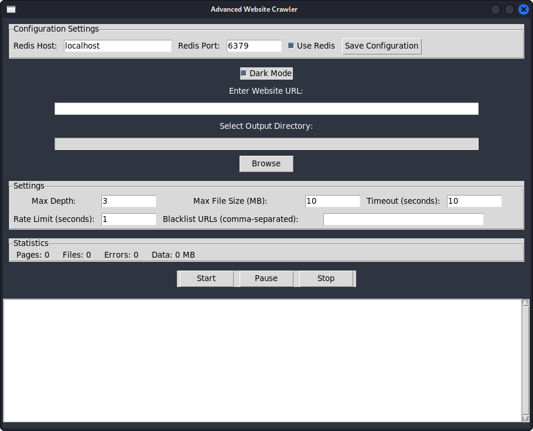

# Beniche-crawler-
Advance web crawler for scraping data from web sites

This is an advanced website crawler built with Python. It is designed to crawl websites, download files, and handle dynamic content using Playwright. The crawler supports distributed crawling with Redis, CAPTCHA solving, and monitoring with Prometheus. It also includes a graphical user interface (GUI) for easy configuration and control.
Features

    Dynamic Content Handling: Uses Playwright to crawl JavaScript-heavy websites.

    Distributed Crawling: Supports Redis for distributed crawling across multiple instances.

    CAPTCHA Solving: Integrates with 2Captcha for solving CAPTCHAs.

    Monitoring: Includes Prometheus metrics for monitoring crawling progress.

    Error Tracking: Uses Sentry for error tracking and reporting.

    GUI: Provides a user-friendly GUI for configuration and control.

    File Organization: Downloads and organizes files into categories (e.g., images, documents, HTML).

    Rate Limiting: Respects rate limits to avoid overloading servers.

    Blacklist Support: Allows specifying URLs to exclude from crawling.

## Screenshot

Installation
Prerequisites

    Python 3.8 or higher: Ensure Python is installed on your system.

    Redis (optional): Required if using distributed crawling. Install Redis on your system or use a cloud provider.

Package Requirements

Install the required Python packages using pip:

pip install -r requirements.txt

requiremets :

requests
beautifulsoup4
playwright
redis
twocaptcha
prometheus_client
sentry-sdk
scrapinghub
tkinter

To generate the requirements.txt file, run

pip freeze > requirements.txt

Additional Setup

    Playwright Browsers: Install the required browsers for Playwright:
    bash
    Copy

    playwright install

    Redis Configuration: If using Redis, ensure the Redis server is running and update the REDIS_HOST and REDIS_PORT variables in the script or GUI.

    2Captcha API Key: If you want to enable CAPTCHA solving, sign up at 2Captcha and add your API key in the GUI.

    Sentry DSN: For error tracking, sign up at Sentry and add your DSN in the script or GUI.

Usage
Running the Crawler

    Start the GUI:

    Run the script to launch the GUI:
  
    python crawler.py

    Configure Settings:

        Enter the website URL to crawl.

        Select the output directory for downloaded files.

        Configure settings such as max depth, file size, timeout, and rate limit.

        Enable or disable Redis for distributed crawling.

    Start Crawling:

    Click the Start button to begin crawling. Use the Pause and Stop buttons to control the crawler.

    View Statistics:

    The GUI displays real-time statistics, including pages crawled, files downloaded, errors encountered, and data downloaded.

    Monitor Metrics:

    Prometheus metrics are available at http://localhost:8000. Use a Prometheus server and Grafana for advanced monitoring.

File Structure

The downloaded files are organized into the following directories:

    html: HTML pages.

    images: Image files (e.g., .jpg, .png).

    documents: Document files (e.g., .pdf, .docx).

    other: Other file types.

Files are saved in date-based subdirectories to organize them by crawl date.
Configuration
Environment Variables

The following environment variables can be configured:

    REDIS_HOST: Redis server host (default: localhost).

    REDIS_PORT: Redis server port (default: 6379).

    SENTRY_DSN: Sentry DSN for error tracking.

    TWOCAPTCHA_API_KEY: 2Captcha API key for CAPTCHA solving.

GUI Settings

    Redis Host/Port: Configure Redis connection details.

    Max Depth: Maximum depth to crawl.

    Max File Size: Maximum file size to download (in MB).

    Timeout: Request timeout (in seconds).

    Rate Limit: Delay between requests (in seconds).

    Blacklist URLs: Comma-separated list of URLs to exclude.

Contributing

Contributions are welcome! Please open an issue or submit a pull request for any improvements or bug fixes.

License :

This project is licensed under the MIT License. See the LICENSE file for details.

Acknowledgments :

    Playwright for dynamic content handling.

    2Captcha for CAPTCHA solving.

    Redis for distributed crawling.

    Prometheus for monitoring.

    Sentry for error tracking.
